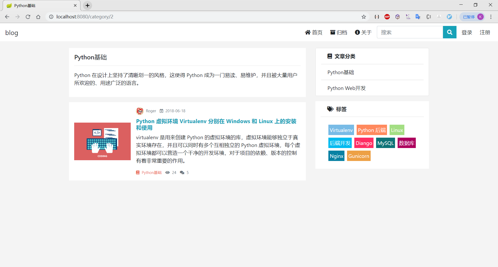

# 个人博客网站

一个使用spring boot 2 + spring mvc + thymeleaf + mysql 8 + spring security制作的个人博客网站

## 图片

 ## 注意事项
 使用时记得注意mysql 版本，设置的用户和密码都是root, 若不同记得在appliation-dev.peroperties中修改。文件默认是保存到项目相对路径的upload文件夹下。